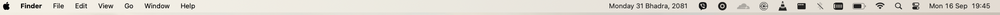

# Introduction 
This is a simple utility tool to display your current nepali date in macos. 

# How to use ? 
You can download from the [Release](https://github.com/dibashthapa/current-nepali-date-macos/releases/download/v1/Nepali.Calendar.2024-09-16.19-48-30.zip)

# Demo

